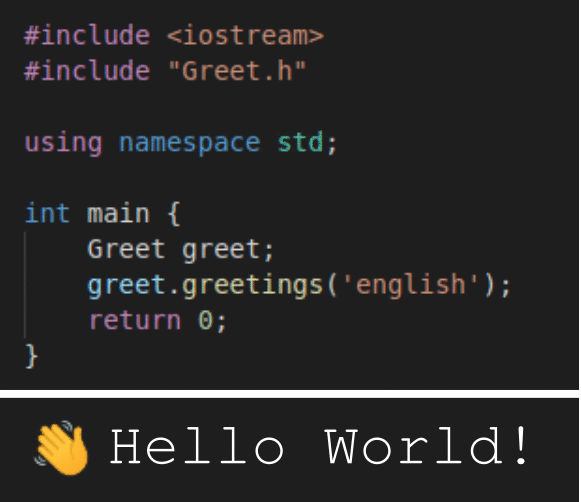
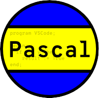
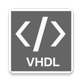

## __Hey 👋, I'm Mathias Garcia!__   

 

 

___

### Welcome to my profile!
I'm an (advanced) electronic engineering student from Argentina, currently working on my thesis degree. We're developing a low cost radiation meter using commercially CMOS sensors for aerospace application. More specifically, we're using a MT9M001 sensor and a (FPGA) Xilinx Zynq-7000 to make a real time algorithm that detects size and intensity of the particles passing through the sensor. Once they are detected, a histogram is made which will then be sent to Earth. 

Although my thesis is oriented to digital design using VHDL, and my main knowledge is about that and all related to electronics. I'm also interested in programming areas, like Game Development and Machine Learning.

 

## Rapidfire 

<table style = "border:0"><tr><td valign="top" width="40%"> 

  
   </td>

<td valign="top" width="60%">

- 🔭 I’m currently working on a low cost radiation meter, using VHDL and HLS.

- ⚡ I want to get a deeper knowledge of digital design but using Verilog.

- 🌱 At the present, I'm learning C++ with intention of continuing with OpenGL.
- 🤖 I'm (also) interested in Machine Learning and High-Performance Computing 
- 🌑 Dark mode lover 
</td></tr></table> 

 

___

## Language and Tools 

         

